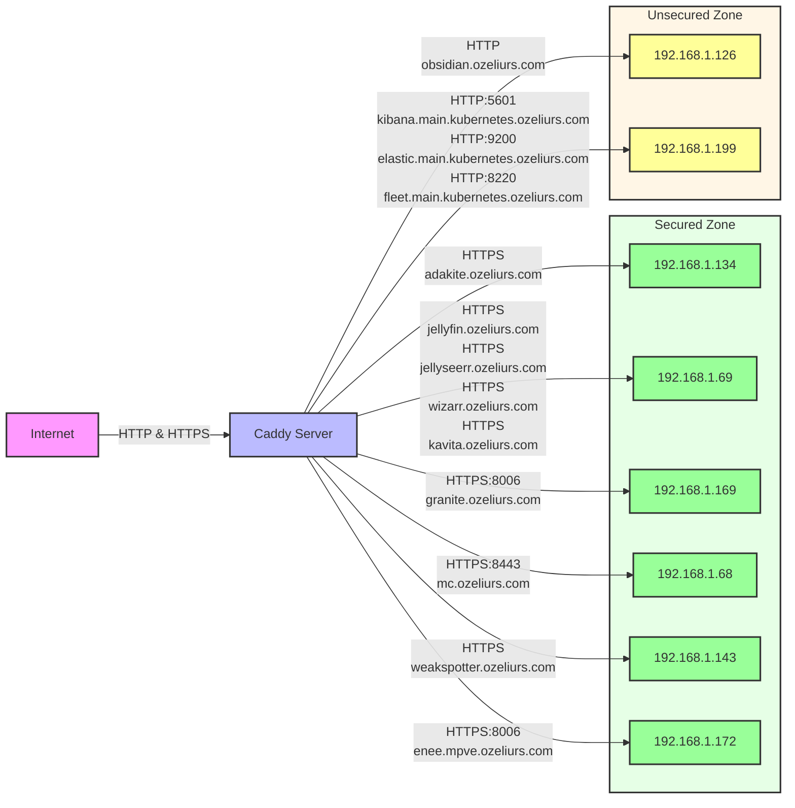

# Reverse Proxy Configuration

This project automates the generation of a Caddyfile and a Mermaid diagram for visualizing the reverse proxy configuration.

## Adding a Domain

1. Open `reverse-proxy-config/domains.json`.
2. Add a new entry under `domains`:

```json
{
  "domains": {
    "newdomain.example.com": {
      "protocol": "https",
      "host": "192.168.1.100",
      "port": 443,
      "wildcard": true
    }
  }
}
```

3. Save the file.

## Generating Configuration

The configuration files are automatically generated and updated using a GitHub Actions workflow on every push to the `main` branch.

## Mermaid Diagram

Below is the Mermaid diagram visualizing the reverse proxy configuration:

<!-- Mermaid Diagram Start -->

<!-- Mermaid Diagram End -->

## License

This project is licensed under the MIT License.
